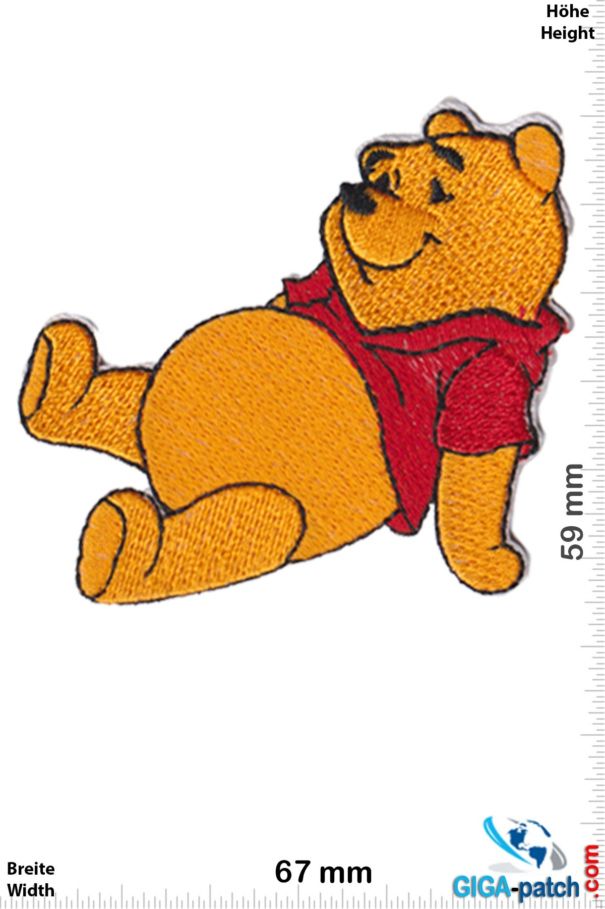
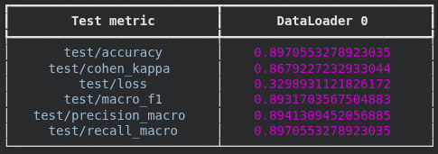
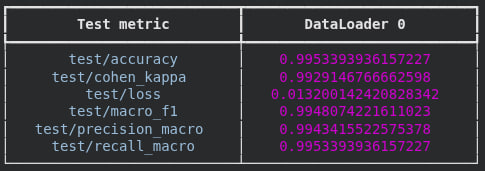

# Disney Character Classification

Многоклассовая классификация 6 персонажей Disney по изображениям.
PyTorch Lightning + Hydra + MLflow + DVC + ONNX.

## Описание проекта

Задача — определить, какой из шести персонажей изображён на картинке:
`donald_duck`, `mickey_mouse`, `minion`, `olaf`, `winnie_the_pooh`, `pumba`.
Прикладной сценарий: классификатор для пайплайна модерации/тегирования
пользовательского контента в детских приложениях и сервисах с лицензионным
контентом Disney/Universal.

## Данные

- **Источник:** [Kaggle — Disney Characters Dataset](https://www.kaggle.com/datasets/sayehkargari/disney-characters-dataset)
- **Автор:** Sayeh Kargari
- **Дата публикации:** 2023 (Kaggle)
- **Объём:** ~120 МБ, 4 667 JPEG-изображений
- **Разбиение:** train/test заранее заданы автором датасета
- **Классы:** `donald_duck`, `mickey_mouse`, `minion`, `olaf`,
  `winnie_the_pooh`, `pumba`
- **Размер входа:** изображения приводятся к 64×64 при обучении
- **Особенности:** мультяшный стиль, варьирующееся качество/освещение/фон,
  умеренный дисбаланс по классам

**Пример входа.** Одиночный RGB-файл (jpg/png), например:
`data/raw/disney/cartoon/train/pooh/winnie-pooh-winnie-pooh-relax.jpg`.



Внутри `infer.py` файл проходит: `PIL.Image.open → convert("RGB") →
resize(64, 64) → /255 → (x − 0.5) / 0.5 → CHW → batch dim`.

Данные не лежат в git. Они подтягиваются автоматически (раздел
[Data](#data)): сначала DVC из локального remote, при недоступности —
Kaggle API (требует `~/.kaggle/kaggle.json`).

## Модели

В проекте две модели: baseline CNN и основная — на
предобученном EfficientNet-B0.

### Baseline CNN

3-блочная свёрточная сеть, обучается с нуля.

**Пайплайн:**

1. **Preprocessing:** Resize(64×64) → RandomHorizontalFlip →
   RandomRotation(15°) → ColorJitter(0.2/0.2) → ToTensor →
   Normalize(mean=0.5, std=0.5).
2. **Training:** AdamW (lr=1e-3, weight_decay=1e-4) +
   CosineAnnealingLR (T_max=30), CrossEntropy, grad_clip=1.0.
3. **Validation:** 10% стратифицированный split от train, основная метрика —
   `val/macro_f1`, EarlyStopping(patience=7).
4. **Postprocessing:** argmax по логитам.

**Архитектура:**

```
Input (3×64×64)
→ Conv(3→8, 3×3) → BN → ReLU → MaxPool(2)    # 32×32
→ Conv(8→16, 3×3) → BN → ReLU → MaxPool(2)   # 16×16
→ Conv(16→32, 3×3) → BN → ReLU → MaxPool(2)  # 8×8
→ Flatten → Linear(2048→64) → ReLU → Dropout(0.5)
→ Linear(64→6)
```

### EfficientNet-B0

Предобученный `torchvision.models.efficientnet_b0` с весами
`EfficientNet_B0_Weights.DEFAULT`.

**Пайплайн:**

1. **Preprocessing:** те же transforms, что в baseline (Resize 64×64 +
   аугментации), затем внутри сети — Upsample до 224×224 под нативный
   input EfficientNet.
2. **Training:** AdamW (lr=1e-3) +
   CosineAnnealingLR (T_max=30), CrossEntropy.
3. **Validation / Postprocessing:** аналогично baseline; на инференсе —
   softmax + argmax.

**Архитектура:**

```
Input (3×64×64)
→ Upsample(224×224)
→ EfficientNet-B0
→ AvgPool → Flatten(1280)
→ Dropout(0.3) → Linear(1280→256) → ReLU → Dropout(0.2)
→ Linear(256→6)
```

## Метрики

Все метрики считаются через
[`torchmetrics`] и логируются
в MLflow на каждой эпохе для всех трёх split'ов (train/val/test).

| Метрика | Зачем нужна | Ожид. (EffNet val) |
| --- | --- | --- |
| `accuracy` | базовая, классы сбалансированы умеренно | ~0.95 |
| `macro_f1` | устойчива к дисбалансу, **primary metric** для checkpoint и EarlyStopping | ~0.95 |
| `precision_macro` | контроль false positives по редким классам | ~0.94 |
| `recall_macro` | контроль пропусков по редким классам | ~0.95 |
| `cohen_kappa` | согласие модели с истиной с поправкой на случайное угадывание | ~0.93 |
| `train/val/test loss` | контроль переобучения, расхождения train↔val | val < 0.2 |


Итоговые метрики на test split:

| Модель | test/accuracy | test/macro_f1 | test/cohen_kappa |
| --- | --- | --- | --- |
| Baseline CNN | 0.897 | 0.893 | 0.868 |
| EfficientNet-B0 | 0.995 | 0.995 | 0.993 |

**Baseline CNN:**



**EfficientNet-B0:**



## Inference

### Ресурсы и производительность

| Стадия                           | CPU | RAM | Время   |
|----------------------------------| --- | --- |---------|
| Preprocessing                    | 1 core | 1 GB | ~1 мин  |
| Training (Baseline, 10 эпох)     | T4 GPU | 4 GB | ~10 мин |
| Training (EfficientNet, 20 эпох) | T4 GPU | 8 GB | ~30 мин |

### Inference pipeline

1. Загрузка ONNX-сессии: `onnxruntime.InferenceSession(model_path,
   providers=["CPUExecutionProvider"])`.
2. Предобработка изображения: `PIL.Image.open → convert("RGB") →
   resize(64, 64) → /255 → (x − 0.5) / 0.5 → CHW → batch dim`.
3. Forward: `sess.run(None, {"image": img})` → logits shape `(1, 6)`.
4. Постобработка: softmax → argmax → возврат JSON
   `{class, confidence, probabilities}`.

## Setup

Зависимости управляются через [`uv`](https://docs.astral.sh/uv/) и описаны
в `pyproject.toml` (lock — `uv.lock`).

```bash
git clone <repo-url> disney-classification
cd disney-classification

uv sync --extra dev
source .venv/bin/activate

pre-commit install
```

## Data

Данные не лежат в git. Есть три способа получить их:

1. **Автоматически** (рекомендуется) — `train.py` сам вызывает
   `DisneyDataModule.prepare_data()`, которая по очереди пробует:

   - `dvc pull -r data_storage` (если remote доступен);
   - Kaggle API (если есть `~/.kaggle/kaggle.json`) — скачивает raw и строит
     манифесты через `scripts/preprocess.py`.

2. **Вручную через DVC:**

   ```bash
   dvc pull -r data_storage   # data/processed/{train,test}.csv + raw
   ```

3. **Вручную через Kaggle API:**

   ```bash
   python scripts/download_data.py
   python scripts/preprocess.py
   ```

DVC настроен на два хранилища (`.dvc/config`):

- `data_storage` — данные (`data/processed/*.csv`)
- `models_storage` — артефакты моделей (`models/model.onnx`,
  `models/model.onnx.data`, при наличии — `models/best.ckpt`)

## Train

Тренировка — одной командой, конфиги через Hydra.

Опционально поднять MLflow tracking server (если недоступен — `train.py`
автоматически фолбэкается на file-backend в `./mlruns`):

```bash
mlflow server --host 127.0.0.1 --port 8080 \
    --backend-store-uri ./mlruns --default-artifact-root ./mlruns
```

Запуск:

```bash
# На CPU — для проверки пайплайна
python scripts/train.py model=baseline training.epochs=1

# Полный baseline (10 эпох)
python scripts/train.py model=baseline

# Полный EfficientNet (GPU)
python scripts/train.py model=main training.epochs=10
```

Любые поля Hydra-конфига можно переопределить из CLI, например
`data.batch_size=64 training.optimizer.lr=5e-4`.

## Export & Inference

Экспорт лучшего чекпойнта в ONNX (opset 17, dynamic batch):

```bash
CKPT=$(ls models/best-epoch*.ckpt | head -1)
python scripts/export.py model=baseline inference.checkpoint_path=$CKPT inference.onnx_path=models/model_smoke.onnx
```

Инференс одиночного изображения:

```bash
python infer.py inference.image_path=path/to/image.jpg
```

Возвращает JSON:

```json
{
  "class": "mickey_mouse",
  "confidence": 0.97,
  "probabilities": { "donald_duck": 0.01, "mickey_mouse": 0.97, ... }
}
```

## Logging

- **MLflow** — `configs/config.yaml: mlflow.tracking_uri`, по умолчанию
  `http://127.0.0.1:8080`; при недоступности —  `./mlruns`.
- Логируются: весь Hydra-конфиг как hyperparams, git commit hash как тег,
  train/val/test loss и 5 метрик по эпохам, чекпойнты модели
  (`log_model=True`).
- В артефакты MLflow попадают: confusion matrices по эпохам и learning
  curves (по одному графику на каждую метрику + loss).
- После `trainer.fit()` графики дополнительно копируются в `plots/`.

## Overall

Структура репозитория:

```
disney-classification/
├── configs/                  # Hydra-конфиги
│   ├── config.yaml           # корневой (defaults + mlflow uri)
│   ├── data/default.yaml
│   ├── model/{baseline,main}.yaml
│   ├── training/default.yaml
│   └── inference/default.yaml
├── src/disney_clf/           # python-пакет
│   ├── data/                 # dataset, datamodule, preprocess
│   ├── models/               # baseline, EfficientNet
│   ├── training/module.py    # LightningModule + логирование
│   └── inference/            # ONNX-экспорт, predict
├── scripts/                  # Hydra entrypoints
│   ├── download_data.py
│   ├── preprocess.py
│   ├── train.py
│   └── export.py
├── infer.py                  # точка входа инференса
├── tests/                    # pytest
├── data/processed/*.dvc      # DVC sidecars (train.csv, test.csv)
├── models/*.dvc              # DVC sidecars (model.onnx, *.data)
├── .dvc/config               # data_storage + models_storage
├── .pre-commit-config.yaml
├── pyproject.toml
└── uv.lock
```

Production-пайплайн:

1. `scripts/train.py` → `models/best-*.ckpt` (Lightning checkpoint) + MLflow run.
2. `scripts/export.py` → `models/model.onnx` (opset 17, dynamic batch).
3. `infer.py` → загружает ONNX через `onnxruntime`, отдаёт JSON-предсказание.
